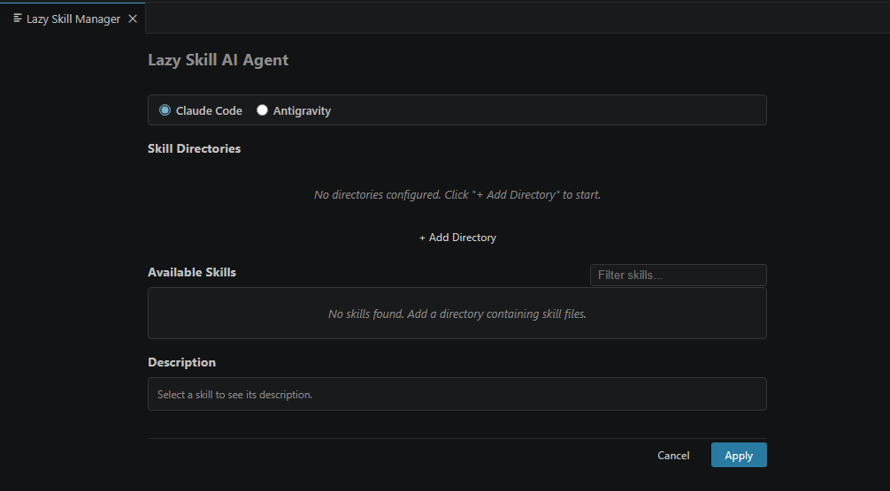

<p align="center">
  
</p>

# Lazy Skill AI Agent

A tool to manage AI skills **and rules** for **Claude Code**, **Antigravity**, **Cursor**, **ZCode (z.ai)**, and **Kimi Code**. Browse skills from multiple source directories and rule files, then add/remove them in your project through a visual interface.



Two versions are available:

- **[extension/](extension/)** — VS Code extension ([Install from Marketplace](https://marketplace.visualstudio.com/items?itemName=dn9uy3n.lazy-skill-ai-agent))
- **[app/](app/)** — Desktop application (standalone, runs on Windows / macOS / Linux)

## Skill Directory Structure

Both versions share the same skill directory convention:

```
my-skills/
├── commit/
│   └── SKILL.md
├── code-review/
│   └── code-review.md
└── feature-dev/
    └── SKILL.md
```

Each subdirectory is one skill. The `.md` file supports optional frontmatter:

```markdown
---
name: commit
description: Auto-generate commit messages
---

# Content...
```

File lookup priority: `SKILL.md` → `{dir-name}.md` → first `.md` file.

When applied, the **entire skill folder** (markdown, scripts, helpers — everything) is copied into the workspace skills directory of the selected platform:

| Platform | Workspace Skills Folder |
|----------|--------------------------|
| **Claude Code** | `{project}/.claude/skills/{skill-name}/` |
| **Antigravity** | `{project}/.agent/skills/{skill-name}/` |
| **Cursor** | `{project}/.cursor/skills/{skill-name}/` |
| **ZCode (z.ai)** | `{project}/.zcode/skills/{skill-name}/` |
| **Kimi Code** | `{project}/.kimi-code/skills/{skill-name}/` |

The platform toggle at the top of the UI controls which folder is read from / written to, and is remembered between sessions. Switching platforms updates the install state of each skill in the list accordingly — a skill installed for one platform is not installed or removed for another.

> **ZCode note:** ZCode drops a skill outright if its frontmatter is missing `name`/`description`, or if `description` exceeds 1024 characters. Apply still installs the skill, but shows a warning so you can fix the source file.

> **Kimi Code note:** Kimi Code likewise fails to load a directory-form `SKILL.md` missing `name` or `description` in its frontmatter (no documented length cap). Apply installs the skill but warns. Kimi also recognizes loose `.md` files at the skills root as "flat" skills — which is why no `SKILL.md` index is generated there (see below).

### Auto-generated skills index (`SKILL.md`)

After every Apply, an index file is generated at the **root of the skills folder** — for example `{project}/.claude/skills/SKILL.md`. It lists every installed skill with:

- **Title** (from the skill's `name` frontmatter)
- **When to use** (from the `description` frontmatter)
- **Location** (relative path to the skill's main `.md` file)

The purpose is to let an AI agent quickly discover the right skill without scanning every subfolder. The index is regenerated on each Apply and deleted automatically when no skills remain. Do not edit it manually — changes will be overwritten.

This index is **not** generated for ZCode: ZCode already surfaces every skill's own `name` and `description` into context itself, so a separate index file would just be unused noise. It is also not generated for Kimi Code — for the same reason, and because Kimi Code would mistake a root-level `SKILL.md` for a flat skill literally named `SKILL`.

Example:

```markdown
# Skills Index

## Available skills

### commit
- **When to use:** Auto-generate commit messages from staged changes
- **Location:** `./commit/SKILL.md`

### review
- **When to use:** Review code for quality and potential issues
- **Location:** `./review/SKILL.md`
```

## Rule Files

In addition to skills, you can also manage **rule files** — single `.md` / `.mdc` / `.txt` files that get copied into the workspace's rules directory.

Add rule files individually via **+ Add Rule File** (multi-select supported), then check the rules you want included in the project.

| Platform | Workspace Rules Folder |
|----------|--------------------------|
| **Claude Code** | `{project}/.claude/rules/{rule-name}.md` |
| **Antigravity** | `{project}/.agents/rules/{rule-name}.md` |
| **Cursor** | `{project}/.cursor/rules/{rule-name}.md` |
| **ZCode (z.ai)** | — merged into `{project}/AGENTS.md` (see below) |
| **Kimi Code** | — merged into `{project}/AGENTS.md` (see below) |

> Note: Antigravity uses `.agent/skills/` (singular) for skills but `.agents/rules/` (plural) for rules — this matches Antigravity's own conventions.

A rule's name is taken from its frontmatter `name` field (or the filename if no frontmatter). The original file extension is preserved on install.

#### Rules on ZCode and Kimi Code: merged into AGENTS.md, not copied as files

ZCode and Kimi Code have no rules folder at all — they only read project instructions from `AGENTS.md`. So when the target platform is ZCode or Kimi Code, a checked rule is not copied as a standalone file; instead its body (frontmatter stripped) is merged into a managed block inside `{project}/AGENTS.md`, delimited by HTML comment markers:

```markdown
<!-- lazy-skill-ai-agent:begin — do not edit inside this block -->
<!-- lazy-skill-ai-agent:rule name="security-review" -->
...rule body...
<!-- lazy-skill-ai-agent:rule-end -->
<!-- lazy-skill-ai-agent:end -->
```

Everything **outside** the markers — your own project instructions — is left untouched on every Apply. Unchecking a rule removes just its entry from the block; unchecking all of them removes the whole block (and deletes `AGENTS.md` if nothing else is in it). Don't hand-edit inside the markers — it's regenerated on every Apply.

---

## Version 1: VS Code Extension

### Install from Marketplace (easiest)

Open VS Code / Antigravity → Extensions tab → search **"Lazy Skill AI Agent"**, or visit:

👉 https://marketplace.visualstudio.com/items?itemName=dn9uy3n.lazy-skill-ai-agent

Or install from CLI:

```bash
code --install-extension dn9uy3n.lazy-skill-ai-agent
```

#### 🪐 Using Antigravity? Enable the Microsoft Marketplace first

Antigravity does not ship with the Microsoft VS Code Marketplace enabled by default. To install any extension from the Microsoft Marketplace (including this one), add the following entries to your Antigravity `settings.json`:

```json
{
  "extensions.gallery.serviceUrl": "https://marketplace.visualstudio.com/_apis/public/gallery",
  "extensions.gallery.itemUrl": "https://marketplace.visualstudio.com/items"
}
```

**How to open `settings.json`:**

1. `Ctrl+Shift+P` (or `Cmd+Shift+P` on macOS)
2. Type: **Preferences: Open User Settings (JSON)**
3. Add the two lines above, save, and **restart Antigravity**

After restart, open the Extensions tab and search for **"Lazy Skill AI Agent"** — the extension will now appear and can be installed like on regular VS Code.

> ⚠️ Per Microsoft's marketplace terms, only Microsoft products (VS Code, Azure Data Studio, etc.) are officially allowed to use this gallery. Use at your own discretion.

### Build & Install from source

```bash
cd extension
npm install
npm run compile
npm run package       # Produces a .vsix file
```

Install into VS Code:
```bash
code --install-extension lazy-skill-ai-agent-0.1.0.vsix
```

Or via UI: **Extensions tab → `...` menu → Install from VSIX...**

For Antigravity:
```bash
antigravity --install-extension lazy-skill-ai-agent-0.1.0.vsix
```

### Development Mode

Open the project in VS Code → press `F5` → select the **"Run Extension"** launch config.

### Usage

`Ctrl+Shift+P` → **Lazy: Open Skill Manager**

---

## Version 2: Desktop Application

A standalone Electron app for Windows, macOS, and Linux.

### Download prebuilt binaries

Get the latest installer from the [GitHub Releases](../../releases) page:

| OS | File |
|----|------|
| Windows | `Lazy Skill AI Agent Setup X.Y.Z.exe` |
| macOS | `Lazy Skill AI Agent-X.Y.Z.dmg` (built via GitHub Actions) |
| Linux | `lazy-skill-ai-agent-app-X.Y.Z.tar.gz` |

### Run in Development Mode

```bash
cd app
npm install
npm start
```

### Build Installers

```bash
cd app

# Windows (.exe installer)
npm run build:win

# macOS (.dmg)
npm run build:mac

# Linux (AppImage + .deb)
npm run build:linux

# All platforms
npm run build:all
```

Installers are placed in `app/dist/`.

### Config File Location

| OS | Path |
|----|------|
| Windows | `%APPDATA%\Lazy Skill AI Agent\config.json` |
| macOS | `~/Library/Application Support/Lazy Skill AI Agent/config.json` |
| Linux | `~/.config/Lazy Skill AI Agent/config.json` |

### Usage

1. Launch the app
2. Click **Browse...** to select your project folder
3. Pick a target platform (Claude Code / Antigravity / Cursor / ZCode)
4. Click **+ Add Directory** to add a directory containing skill subfolders
5. Click **+ Add Rule File** to add individual rule files
6. Check the skills + rules you want to include
7. Click **Apply**

---

## Version Comparison

| Feature | Extension | Desktop App |
|---------|-----------|-------------|
| Platform | VS Code / Antigravity | Windows / macOS / Linux |
| Standalone | No | Yes |
| Project path | Current workspace folder | Selected manually |
| Size | ~50KB | ~100MB (Electron) |
| Requires VS Code | Yes | No |

---

## Repository Layout

```
lazy-skill-ai-agent/
├── extension/           # VS Code extension
│   ├── src/
│   ├── media/
│   └── package.json
├── app/                 # Electron desktop app
│   ├── src/             # Main + preload process
│   ├── renderer/        # UI (HTML/CSS/JS)
│   └── package.json
├── .vscode/             # Debug configs for both
└── README.md
```

## Requirements

- Node.js >= 18
- npm >= 9
- VS Code >= 1.85 (for the extension)

## License

MIT
